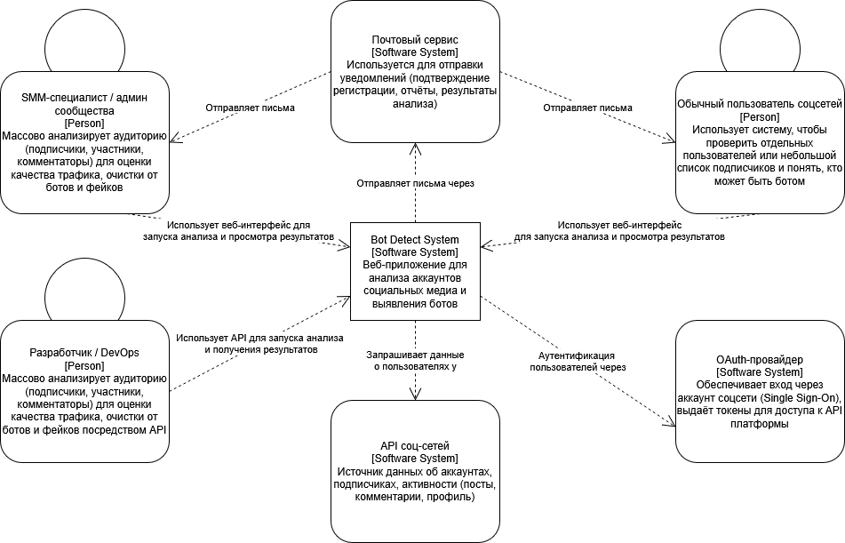
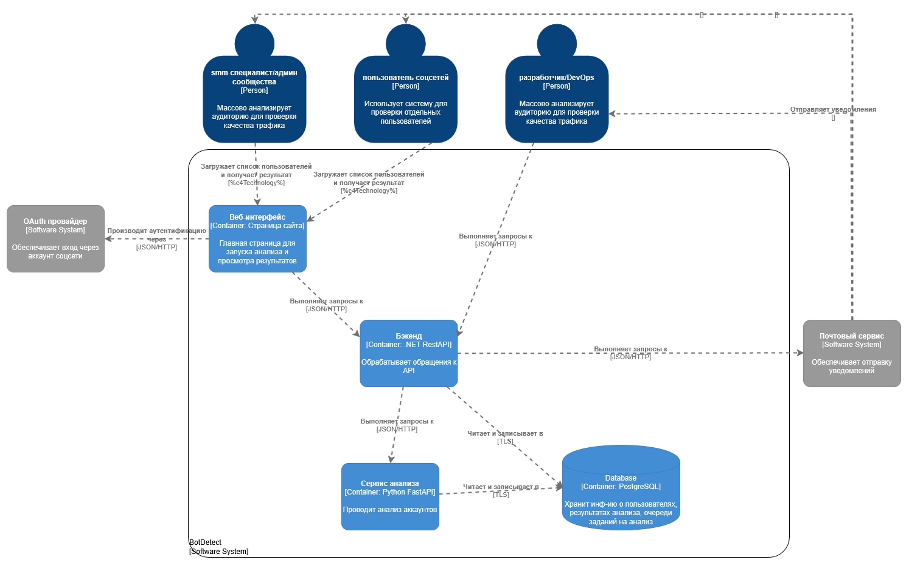

# Лабораторная работа №2

Тема: Использование нотации C4 model для проектирования архитектуры программной системы

Цель работы: Получить опыт использования графической нотации для фиксации архитектурных решений.

## Диаграмма системного контекста

## Диаграмма контейнеров

## Диаграмма компонентов

<Представить диаграмму / диаграммы компонентов. Дать краткое описание основных элементов диаграммы / диаграмм.>
