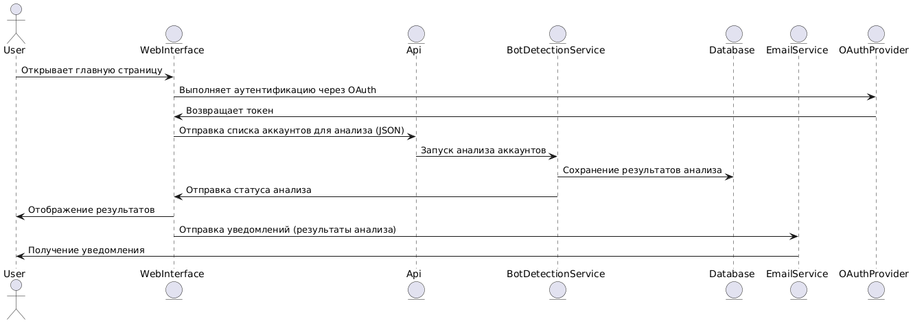
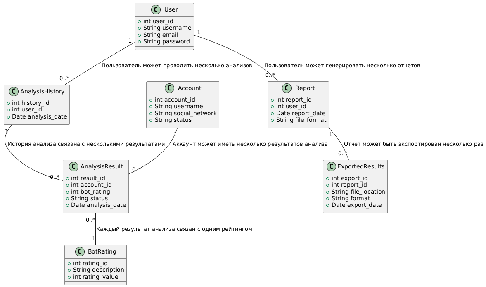

# Лабораторная работа №3

Тема: Использование принципов проектирования на уровне методов и классов

Цель работы: Получить опыт проектирования и реализации модулей с использованием принципов KISS, YAGNI, DRY, SOLID и др.

## Диаграмма контейнеров


## Диаграмма компонентов


## Диаграмма последовательностей



#### Объяснение:

**Пользователь** инициирует запрос, открывая страницу веб-интерфейса. **Веб-интерфейс** отправляет запрос на аутентификацию в **OAuthProvider** , который выполняет проверку через соцсеть и возвращает токен. После получения токена, **WebInterface** отправляет запрос в **API** ,передавая список аккаунтов для анализа. **API** передает запрос на анализ в **BotDetectionService** . **BotDetectionService** выполняет анализ и сохраняет результаты в **базу данных**. Результаты анализа возвращаются обратно в **веб-интерфейс** ,который отображает информацию пользователю. Также, **веб-интерфейс** отправляет уведомления по результатам анализа пользователю через **EmailService**.

## Модель БД



#### Объяснение связей:

* **User - AnalysisHistory**: Один пользователь может иметь несколько записей в истории анализов, так как он может проводить несколько анализов.
* **User - Report**: Один пользователь может создавать несколько отчетов, так как один пользователь может генерировать несколько отчетов.
* **Account - AnalysisResult**: Один аккаунт может иметь несколько результатов анализа, так как для каждого аккаунта может быть выполнено несколько проверок.
* **AnalysisResult - BotRating**: Каждый результат анализа связан с одним рейтингом бота, так как не все результаты могут быть оценены как бот.
* **AnalysisHistory - AnalysisResult**: История анализа может содержать несколько результатов анализов, так как один анализ может приводить к нескольким результатам.
* **Report - ExportedResults**: Один отчет может быть экспортирован несколько раз, так как отчет может быть экспортирован в различные форматы.

## Применение основных принципов разработки

#### KISS

```
// api/analysisClient.ts
import axios from "axios";
export interface RunAnalysisRequest {
  socialNetwork: "vk" | "tg" | "ig" | "x";
  accountIds: string[];
}

export const runAnalysis = (data: RunAnalysisRequest) => {
  return axios.post("/api/analysis", data);
};
```

**Пояснение:**

Функция `runAnalysis` отправляет запрос на запуск анализа аккаунтов. В ней нет дополнительной валидации, скрытых преобразований данных или кэшей. При необходимости более сложная логика, например, проверка формы, отображение уведомлений, будет выноситься в другие уровни.

---

#### YAGNI

```
// Application/Analysis/AnalysisService.cs
public class AnalysisService : IAnalysisService
{
    private readonly IAnalysisTaskRepository _tasks;
    private readonly IAnalysisQueue _queue;

    public AnalysisService(IAnalysisTaskRepository tasks, IAnalysisQueue queue)
    {
        _tasks = tasks;
        _queue = queue;
    }

    public Guid EnqueueAnalysis(CreateAnalysisDto dto, Guid userId)
    {
        var task = AnalysisTask.Create(
            userId,
            dto.SocialNetwork,
            dto.AccountIds
        );

        _tasks.Save(task);
        _queue.Enqueue(task.Id);

        return task.Id;
    }
}

```

**Пояснение:**

Метод `EnqueueAnalysis` создаёт задачу анализа, сохраняет её и ставит в очередь.

---

#### DRY

Выделение общего доступа к данным в репозитории (чтобы не дублировать ORM-логику)

```
// Domain/Analysis/IAnalysisTaskRepository.cs
public interface IAnalysisTaskRepository
{
    AnalysisTask? GetById(Guid id);
    void Save(AnalysisTask task);
    IEnumerable<AnalysisTask> GetByUser(Guid userId);
}

// Infrastructure/Analysis/AnalysisTaskRepository.cs
public class AnalysisTaskRepository : IAnalysisTaskRepository
{
    private readonly BotDetectDbContext _db;

    public AnalysisTaskRepository(BotDetectDbContext db)
    {
        _db = db;
    }

    public AnalysisTask? GetById(Guid id) =>
        _db.AnalysisTasks.SingleOrDefault(t => t.Id == id);

    public IEnumerable<AnalysisTask> GetByUser(Guid userId) =>
        _db.AnalysisTasks.Where(t => t.UserId == userId).ToList();

    public void Save(AnalysisTask task)
    {
        _db.Update(task);
        _db.SaveChanges();
    }
}

```

**Пояснение:**

Вся логика доступа к таблице задач анализа сосредоточена в одном репозитории. Контроллеры и сервисы не содержат дублирующихся фрагментов кода с одинаковыми запросами к базе. Если изменится схема БД или ORM-конфигурация, правки вносятся в одном месте.

---

#### SOLID

Сервис получения результата анализа с использованием абстракций и событий:

```
// Application/Analysis/AnalysisResultService.cs
public class AnalysisResultService : IAnalysisResultService
{
    private readonly IAnalysisTaskRepository _tasks;
    private readonly IAccountResultRepository _results;
    private readonly INotificationPublisher _publisher;

    public AnalysisResultService(
        IAnalysisTaskRepository tasks,
        IAccountResultRepository results,
        INotificationPublisher publisher)
    {
        _tasks = tasks;
        _results = results;
        _publisher = publisher;
    }

    public AnalysisSummaryDto GetSummary(Guid taskId, Guid userId)
    {
        var task = _tasks.GetById(taskId)
                  ?? throw new NotFoundException("Task not found");

        if (task.UserId != userId)
            throw new AccessDeniedException();

        var accounts = _results.GetByTask(taskId);
        var summary = AnalysisSummaryDto.From(accounts);

        _publisher.Publish(new AnalysisViewedEvent(taskId, userId));

        return summary;
    }
}

```

```
// Domain/Analysis/IAccountResultRepository.cs
public interface IAccountResultRepository
{
    IEnumerable<AccountAnalysisResult> GetByTask(Guid taskId);
}

```

**Пояснение:**

**S – Single Responsibility Principle**

`AnalysisResultService` отвечает только за бизнес-логику получения и агрегирования результатов анализа, не занимается сохранением данных, отправкой писем или логированием.

**O – Open/Closed Principle**

Расширение поведения реализуется через публикацию событий и подписчиков на них. Чтобы, например, добавить отправку e-mail или запись в очередь, достаточно создать новый обработчик события, не меняя код сервиса.

**L – Liskov Substitution Principle**

Сервис используется через интерфейс `IAnalysisResultService`. Любая другая реализация этого интерфейса (например, кэшируемая или тестовая in-memory) может подставляться вместо текущей без изменения вызывающего кода.

**I – Interface Segregation Principle**

`IAccountResultRepository` содержит только методы, необходимые для получения результатов анализа. Репозиторий не перегружен методами, которые сервису не нужны (обновление, удаление и т.д.).

**D – Dependency Inversion Principle**

`AnalysisResultService` зависит от абстракций (`IAnalysisTaskRepository`, `IAccountResultRepository`, `INotificationPublisher`), а не от конкретных реализаций. Это позволяет подставлять заглушки, моки и свободно менять инфраструктуру (ORM, брокер сообщений, реализацию уведомлений) без изменения бизнес-логики.
