# Лабораторная работа №4

Тема: Проектирование REST API

Цель работы: Получить опыт проектирования программного интерфейса.

## Документация по API

## 1. Анализ

**Базовый путь:** `api/analysis`

### 1.1 Запуск анализа

| Параметр             | Значение                                                                                             |
| ---------------------------- | ------------------------------------------------------------------------------------------------------------ |
| **Метод**         | `POST`                                                                                                     |
| **URL**                | `/api/analysis`                                                                                            |
| **Заголовки** | `Content-Type: application/json`, `X-User-Id: <int>` (опционально, по умолчанию 1) |

**Тело запроса:**

| Поле          | Тип   | Обязательное | Описание                                                              |
| ----------------- | -------- | ------------------------ | ----------------------------------------------------------------------------- |
| `socialNetwork` | string   | да                     | Соцсеть:`"vk"`, `"tg"`, `"ig"`, `"x"` и т.п.                |
| `accountIds`    | string[] | да                     | Массив идентификаторов аккаунтов (строки) |

**Пример запроса:**

```json
{
  "socialNetwork": "vk",
  "accountIds": ["user1", "user2"]
}
```

**Ответ:** `201 Created`

| Поле      | Тип | Описание                                  |
| ------------- | ------ | ------------------------------------------------- |
| `historyId` | int    | ID созданной записи анализа |

**Пример ответа:**

```json
{
  "historyId": 42
}
```

---

### 1.2 Статус и результаты анализа 

| Параметр                    | Значение                                           |
| ----------------------------------- | ---------------------------------------------------------- |
| **Метод**                | `GET`                                                    |
| **URL**                       | `/api/analysis/{id}`                                     |
| **Параметр пути** | `id` (int) — ID записи анализа (HistoryId) |
| **Заголовки**        | `X-User-Id: <int>` (опционально)              |

**Тело запроса:** не используется.

**Ответ:** `200 OK`

| Поле         | Тип            | Описание                                                         |
| ---------------- | ----------------- | ------------------------------------------------------------------------ |
| `historyId`    | int               | ID анализа                                                        |
| `status`       | string            | Статус:`"Pending"`, `"Running"`, `"Completed"`, `"Failed"` |
| `analysisDate` | string (ISO 8601) | Дата/время анализа                                       |
| `results`      | array             | Массив результатов по аккаунтам              |

Элемент массива `results`:

| Поле                 | Тип | Описание                                     |
| ------------------------ | ------ | ---------------------------------------------------- |
| `accountId`            | int    | ID аккаунта                                  |
| `username`             | string | Имя пользователя                      |
| `socialNetwork`        | string | Соцсеть                                       |
| `botRatingValue`       | int    | Числовая оценка бот не бот     |
| `botRatingDescription` | string | Текстовое описание рейтинга |
| `status`               | string | Статус результата                    |

**Пример ответа:**

```json
{
  "historyId": 42,
  "status": "Completed",
  "analysisDate": "2026-02-23T12:00:00",
  "results": [
    {
      "accountId": 1,
      "username": "user1",
      "socialNetwork": "vk",
      "botRatingValue": 75,
      "botRatingDescription": "Вероятный бот",
      "status": "Completed"
    }
  ]
}
```

**Коды ошибок:** `404 Not Found` (анализ не найден), `403 Forbidden` (нет доступа для данного пользователя).

---

### 1.3 Список анализов пользователя

| Параметр             | Значение                              |
| ---------------------------- | --------------------------------------------- |
| **Метод**         | `GET`                                       |
| **URL**                | `/api/analysis`                             |
| **Заголовки** | `X-User-Id: <int>` (опционально) |

**Тело запроса:** не используется.

**Ответ:** `200 OK` — JSON массив.

Каждый элемент:

| Поле          | Тип            | Описание        |
| ----------------- | ----------------- | ----------------------- |
| `historyId`     | int               | ID анализа       |
| `status`        | string            | Статус            |
| `analysisDate`  | string (ISO 8601) | Дата анализа |
| `socialNetwork` | string            | Соцсеть          |

**Пример ответа:**

```json
[
  { "historyId": 42, "status": "Completed", "analysisDate": "2025-02-23T12:00:00", "socialNetwork": "vk" },
  { "historyId": 41, "status": "Pending", "analysisDate": "2025-02-22T10:00:00", "socialNetwork": "tg" }
]
```

---

## 2. Аккаунты

**Базовый путь:** `api/accounts`

### 2.1 Получение аккаунта

| Параметр                    | Значение                    |
| ----------------------------------- | ----------------------------------- |
| **Метод**                | `GET`                             |
| **URL**                       | `/api/accounts/{id}`              |
| **Параметр пути** | `id` (int) — ID аккаунта |

**Ответ:** `200 OK` — один объект аккаунта (JSON).

| Поле          | Тип | Описание                |
| ----------------- | ------ | ------------------------------- |
| `accountId`     | int    | ID аккаунта             |
| `username`      | string | Имя пользователя |
| `socialNetwork` | string | Соцсеть                  |
| `status`        | string | Статус                    |

**Пример ответа:**

```json
{
  "accountId": 1,
  "username": "user1",
  "socialNetwork": "vk",
  "status": "Active"
}
```

**Код ошибки:** `404 Not Found` - аккаунт не найден.

---

### 2.2 Создание аккаунта

| Параметр             | Значение                   |
| ---------------------------- | ---------------------------------- |
| **Метод**         | `POST`                           |
| **URL**                | `/api/accounts`                  |
| **Заголовки** | `Content-Type: application/json` |

**Тело запроса (JSON):**

| Поле          | Тип | Обязательное | Описание                                  |
| ----------------- | ------ | ------------------------ | ------------------------------------------------- |
| `username`      | string | да                     | Имя пользователя в соцсети |
| `socialNetwork` | string | да                     | Соцсеть (`"vk"`, `"tg"`, `"x"`)      |

**Пример запроса:**

```json
{
  "username": "new_user",
  "socialNetwork": "vk"
}
```

**Ответ:** `201 Created`

**Пример ответа:**

```json
{
  "accountId": 5,
  "username": "new_user",
  "socialNetwork": "vk",
  "status": ""
}
```

---

### 2.3 Обновление аккаунта

| Параметр                    | Значение                    |
| ----------------------------------- | ----------------------------------- |
| **Метод**                | `PUT`                             |
| **URL**                       | `/api/accounts/{id}`              |
| **Параметр пути** | `id` (int) — ID аккаунта |
| **Заголовки**        | `Content-Type: application/json`  |

**Тело запроса (JSON):**

| Поле     | Тип        | Обязательное | Описание                                                      |
| ------------ | ------------- | ------------------------ | --------------------------------------------------------------------- |
| `username` | string\| null | нет                   | Новое имя пользователя (null = не менять) |
| `status`   | string\| null | нет                   | Новый статус (null = не менять)                    |

**Пример запроса:**

```json
{
  "username": "updated_name",
  "status": "Suspended"
}
```

**Ответ:** `200 OK` — JSON объект аккаунта после обновления (формат как в 2.1).
**Код ошибки:** `404 Not Found`, если аккаунт не найден

---

### 2.4 Удаление аккаунта

| Параметр                    | Значение                    |
| ----------------------------------- | ----------------------------------- |
| **Метод**                | `DELETE`                          |
| **URL**                       | `/api/accounts/{id}`              |
| **Параметр пути** | `id` (int) — ID аккаунта |

**Тело запроса:** -

**Ответ:** `204 No Content` — тело пустое
**Код ошибки:** `404 Not Found`, если аккаунт не найден

---

## 3. Отчёты

**Базовый путь:** `api/reports`

### 3.1 Создание отчёта

| Параметр             | Значение                                                                  |
| ---------------------------- | --------------------------------------------------------------------------------- |
| **Метод**         | `POST`                                                                          |
| **URL**                | `/api/reports`                                                                  |
| **Заголовки** | `Content-Type: application/json`, `X-User-Id: <int>` (опционально) |

**Тело запроса (JSON):**

| Поле       | Тип | Обязательное | Описание                                                     |
| -------------- | ------ | ------------------------ | -------------------------------------------------------------------- |
| `historyId`  | int    | да                     | ID анализа, по которому строится отчёт |
| `fileFormat` | string | нет                   | Формат файла, по умолчанию `"pdf"`           |

**Пример запроса:**

```json
{
  "historyId": 42,
  "fileFormat": "pdf"
}
```

**Ответ:** `201 Created` — JSON.

| Поле     | Тип | Описание                     |
| ------------ | ------ | ------------------------------------ |
| `reportId` | int    | ID созданного отчёта |

**Пример ответа:**

```json
{
  "reportId": 10
}
```

**Коды ошибок:** `404 Not Found` (анализ не найден), `403 Forbidden` (нет доступа).

---

### 3.2 Получение отчёта

| Параметр                    | Значение                              |
| ----------------------------------- | --------------------------------------------- |
| **Метод**                | `GET`                                       |
| **URL**                       | `/api/reports/{id}`                         |
| **Параметр пути** | `id` (int) — ID отчёта               |
| **Заголовки**        | `X-User-Id: <int>` (опционально) |

**Ответ:** `200 OK` — JSON объект отчёта.

| Поле       | Тип            | Описание                                                     |
| -------------- | ----------------- | -------------------------------------------------------------------- |
| `reportId`   | int               | ID отчёта                                                      |
| `userId`     | int               | ID пользователя                                          |
| `reportDate` | string (ISO 8601) | Дата создания отчёта                               |
| `fileFormat` | string            | Формат файла                                              |
| `exports`    | array             | Массив экспортированных результатов |

Элемент `exports`:

| Поле         | Тип            | Описание              |
| ---------------- | ----------------- | ----------------------------- |
| `exportId`     | int               | ID экспорта           |
| `fileLocation` | string            | Путь/URL к файлу    |
| `format`       | string            | Формат экспорта |
| `exportDate`   | string (ISO 8601) | Дата экспорта     |

**Пример ответа:**

```json
{
  "reportId": 10,
  "userId": 1,
  "reportDate": "2025-02-23T14:00:00",
  "fileFormat": "pdf",
  "exports": [
    {
      "exportId": 1,
      "fileLocation": "/reports/10/export_1.pdf",
      "format": "pdf",
      "exportDate": "2025-02-23T14:00:00"
    }
  ]
}
```

**Код ошибки:** `404 Not Found`, если отчёт не найден или нет доступа.

---

### 3.3 Список отчётов пользователя

| Параметр             | Значение                              |
| ---------------------------- | --------------------------------------------- |
| **Метод**         | `GET`                                       |
| **URL**                | `/api/reports`                              |
| **Заголовки** | `X-User-Id: <int>` (опционально) |

**Ответ:** `200 OK` — JSON массив.

Каждый элемент:

| Поле       | Тип            | Описание        |
| -------------- | ----------------- | ----------------------- |
| `reportId`   | int               | ID отчёта         |
| `reportDate` | string (ISO 8601) | Дата отчёта   |
| `fileFormat` | string            | Формат файла |

**Пример ответа:**

```json
[
  { "reportId": 10, "reportDate": "2025-02-23T14:00:00", "fileFormat": "pdf" }
]
```

---

## 4. Очередь и результаты

**Базовый путь:** `api/bot-detection`
Назначение: сервис выявления ботов — забирает задачу из очереди и отправляет результаты.

### 4.1 Получение задачи из очереди

| Параметр     | Значение               |
| -------------------- | ------------------------------ |
| **Метод** | `GET`                        |
| **URL**        | `/api/bot-detection/dequeue` |

**Тело запроса:** не используется.

**Ответ:**

- `200 OK` — есть задача, в теле — JSON объект.
- `204 No Content` — очереди пуста или подходящей задачи нет.

Формат ответа при `200 OK`:

| Поле          | Тип | Описание                       |
| ----------------- | ------ | -------------------------------------- |
| `historyId`     | int    | ID анализа                      |
| `userId`        | int    | ID пользователя            |
| `socialNetwork` | string | Соцсеть                         |
| `accounts`      | array  | Аккаунты для анализа |

Элемент `accounts`:

| Поле      | Тип | Описание                       |
| ------------- | ------ | -------------------------------------- |
| `accountId` | int    | ID аккаунта                    |
| `resultId`  | int    | ID результата анализа |
| `username`  | string | Имя пользователя        |

**Пример ответа:**

```json
{
  "historyId": 42,
  "userId": 1,
  "socialNetwork": "vk",
  "accounts": [
    { "accountId": 1, "resultId": 100, "username": "user1" },
    { "accountId": 2, "resultId": 101, "username": "user2" }
  ]
}
```

---

### 4.2 Сохранение результата анализа

| Параметр             | Значение                   |
| ---------------------------- | ---------------------------------- |
| **Метод**         | `POST`                           |
| **URL**                | `/api/bot-detection/results`     |
| **Заголовки** | `Content-Type: application/json` |

**Тело запроса (JSON):**

| Поле      | Тип | Обязательное | Описание                                                     |
| ------------- | ------ | ------------------------ | -------------------------------------------------------------------- |
| `historyId` | int    | да                     | ID анализа                                                    |
| `resultId`  | int    | да                     | ID результата (одного из `accounts[].resultId`)  |
| `ratingId`  | int    | да                     | ID рейтинга из справочника BotRating            |
| `status`    | string | да                     | Статус результата (например,`"Completed"`) |

**Пример запроса:**

```json
{
  "historyId": 42,
  "resultId": 100,
  "ratingId": 2,
  "status": "Completed"
}
```

**Ответ:**

- `200 OK` — результат сохранён, тело пустое.
- `404 Not Found` — запись результата не найдена.
- `400 Bad Request` — неверный `ratingId` (текст: `"Invalid rating"`).

---

## Сводная таблица эндпоинтов

| Метод | Endpoint                       | Назначение                                   |
| ---------- | ------------------------------ | ------------------------------------------------------ |
| POST       | `/api/analysis`              | Запуск анализа                            |
| GET        | `/api/analysis/{id}`         | Статус и результаты анализа    |
| GET        | `/api/analysis`              | Список анализов пользователя |
| GET        | `/api/accounts/{id}`         | Получение аккаунта                    |
| POST       | `/api/accounts`              | Создание аккаунта                      |
| PUT        | `/api/accounts/{id}`         | Обновление аккаунта                  |
| DELETE     | `/api/accounts/{id}`         | Удаление аккаунта.                     |
| POST       | `/api/reports`               | Создание отчёта                          |
| GET        | `/api/reports/{id}`          | Получение отчёта                        |
| GET        | `/api/reports`               | Список отчётов пользователя   |
| GET        | `/api/bot-detection/dequeue` | Получение задачи из очереди    |
| POST       | `/api/bot-detection/results` | Сохранение результата              |

## Тестирование API

По каждому реализуемому API предоставить следующую информацию:

* Тестируемое API.
* Метод.
* Строка запроса, используемая для тестирования. Можно представить в виде текстовой строки или принтскрина из Postman, чтобы продемонстрировать все передаваемые данные.
* Принтскрин из Postman передаваемых заголовков и параметров (Params, Authorization, Headers, Body).
* Принтскрины из Postman полученного ответа (Body и Headers).
* Код автотестов (на получение возвращаемого статуса и содержимого ответа).
* Принтскрины из Postman результатов тестирования (Test Results).

## 1. POST `/api/analysis` - запуск анализа

POST-запрос с корректным телом (соцсеть и массив идентификаторов аккаунтов) завершился с кодом 201 Created. В ответе возвращён уникальный идентификатор записи анализа historyId.

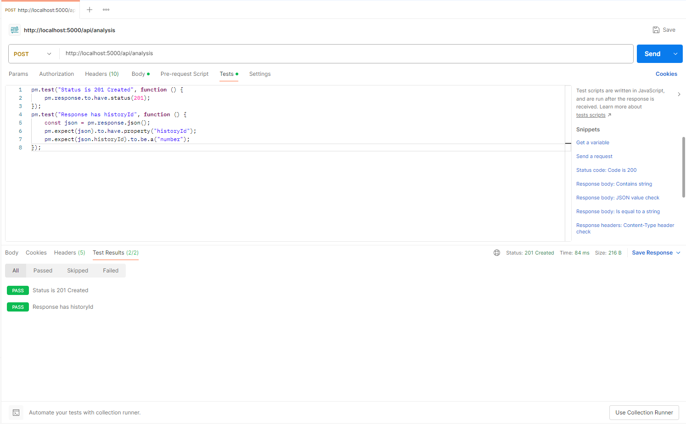

**Автотесты:**

```javascript
pm.test("Status is 201 Created", function () {
    pm.response.to.have.status(201);
});
pm.test("Response has historyId", function () {
    const json = pm.response.json();
    pm.expect(json).to.have.property("historyId");
    pm.expect(json.historyId).to.be.a("number");
});
```

---

## 2. GET `/api/analysis/id` - статус и результаты анализа

GET-запрос по идентификатору анализа завершился с кодом 200 OK. В ответе возвращены идентификатор анализа historyId, статус выполнения, дата анализа и массив результатов по аккаунтам (учётная запись, рейтинг, статус).

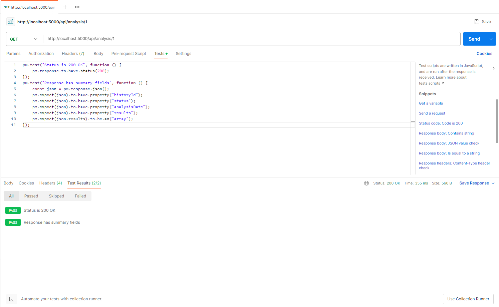

**Автотесты:**

```javascript
pm.test("Status is 200 OK", function () {
    pm.response.to.have.status(200);
});
pm.test("Response has summary fields", function () {
    const json = pm.response.json();
    pm.expect(json).to.have.property("historyId");
    pm.expect(json).to.have.property("status");
    pm.expect(json).to.have.property("analysisDate");
    pm.expect(json).to.have.property("results");
    pm.expect(json.results).to.be.an("array");
});
```

---

## 3. GET `/api/analysis` - список анализов пользователя

GET-запрос без параметров (с заголовком X-User-Id) завершился с кодом 200 OK. В ответе возвращён список анализов пользователя: для каждой записи — идентификатор, статус, дата и соцсеть.

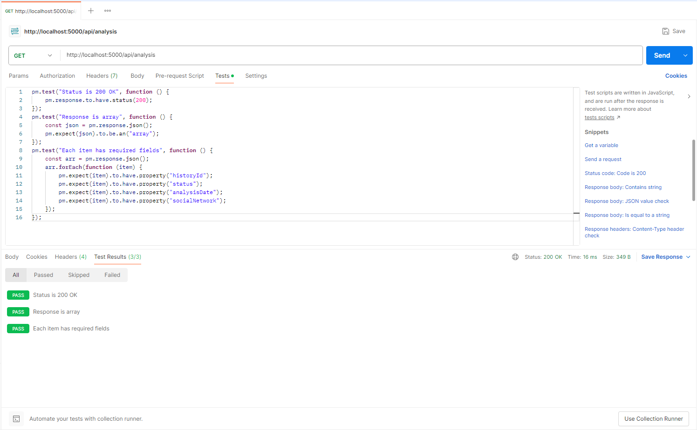

**Автотесты:**

```javascript
pm.test("Status is 200 OK", function () {
    pm.response.to.have.status(200);
});
pm.test("Response is array", function () {
    const json = pm.response.json();
    pm.expect(json).to.be.an("array");
});
pm.test("Each item has required fields", function () {
    const arr = pm.response.json();
    arr.forEach(function (item) {
        pm.expect(item).to.have.property("historyId");
        pm.expect(item).to.have.property("status");
        pm.expect(item).to.have.property("analysisDate");
        pm.expect(item).to.have.property("socialNetwork");
    });
});
```

---

## 4. GET `/api/accounts/id` - получение аккаунта

GET-запрос по идентификатору аккаунта завершился с кодом 200 OK. В ответе возвращены идентификатор аккаунта, имя пользователя, соцсеть и статус. В случае, когда пользователя не существует, вернулась ошибка 404 Not Found.


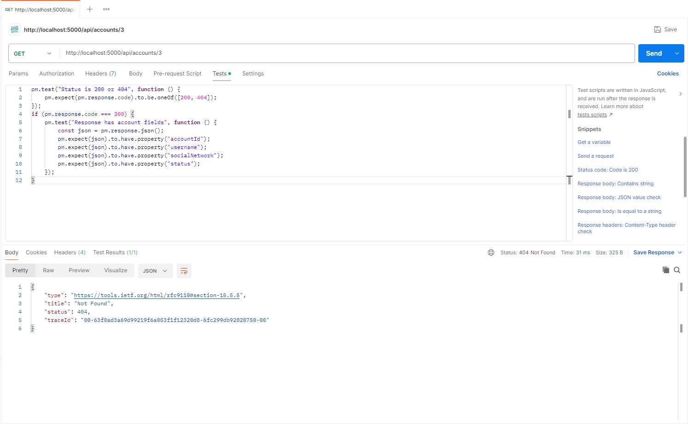

**Автотесты:**

```javascript
pm.test("Status is 200 or 404", function () {
    pm.expect(pm.response.code).to.be.oneOf([200, 404]);
});
if (pm.response.code === 200) {
    pm.test("Response has account fields", function () {
        const json = pm.response.json();
        pm.expect(json).to.have.property("accountId");
        pm.expect(json).to.have.property("username");
        pm.expect(json).to.have.property("socialNetwork");
        pm.expect(json).to.have.property("status");
    });
}
```

---

## 5. POST `/api/accounts` - создание аккаунта

POST-запрос с корректным телом (имя пользователя и соцсеть) завершился с кодом 201 Created. В ответе возвращён созданный объект аккаунта с уникальным идентификатором accountId.

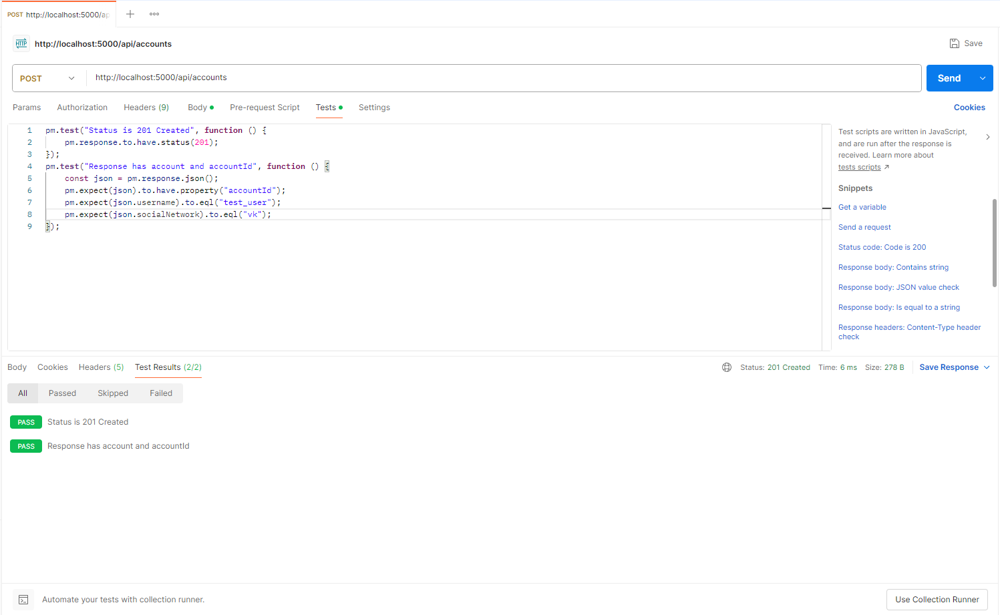

**Автотесты:**

```javascript
pm.test("Status is 201 Created", function () {
    pm.response.to.have.status(201);
});
pm.test("Response has account and accountId", function () {
    const json = pm.response.json();
    pm.expect(json).to.have.property("accountId");
    pm.expect(json.username).to.eql("test_user");
    pm.expect(json.socialNetwork).to.eql("vk");
});
```

---

## 6. PUT `/api/accounts/id` - обновление аккаунта

PUT-запрос с телом (имя пользователя и/или статус) по идентификатору аккаунта завершился с кодом 200 OK (и 404 при отсутствии). В ответе возвращён обновлённый объект аккаунта с актуальными полями.


**Т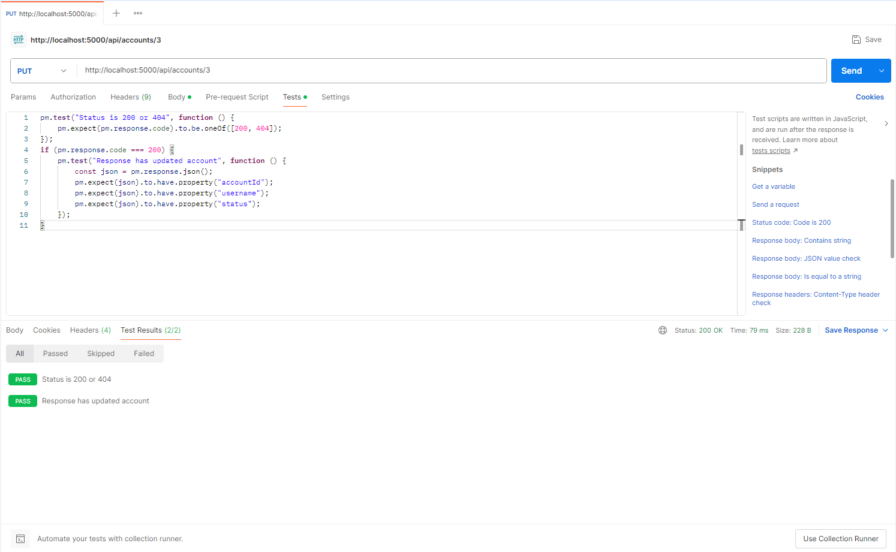**

**Автотесты:**

```javascript
pm.test("Status is 200 or 404", function () {
    pm.expect(pm.response.code).to.be.oneOf([200, 404]);
});
if (pm.response.code === 200) {
    pm.test("Response has updated account", function () {
        const json = pm.response.json();
        pm.expect(json).to.have.property("accountId");
        pm.expect(json).to.have.property("username");
        pm.expect(json).to.have.property("status");
    });
}
```

---

## 7. DELETE `/api/accounts/id` - удаление аккаунта

DELETE-запрос по идентификатору аккаунта завершился с кодом 204 No Content. Тело ответа пустое. Аккаунт удалён.


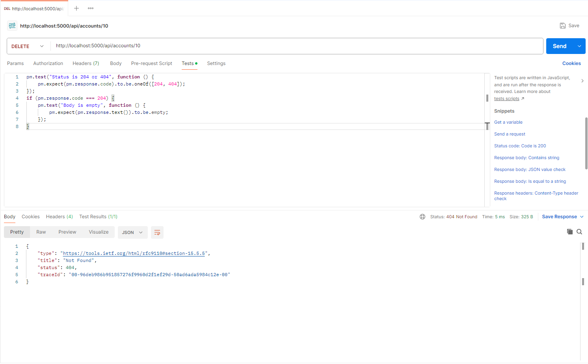

**Автотесты:**

```javascript
pm.test("Status is 204 or 404", function () {
    pm.expect(pm.response.code).to.be.oneOf([204, 404]);
});
if (pm.response.code === 204) {
    pm.test("Body is empty", function () {
        pm.expect(pm.response.text()).to.be.empty;
    });
}
```

---

## 8. POST `/api/reports` - создание отчёта

POST-запрос с корректным телом (идентификатор анализа и формат файла) завершился с кодом 201 Created. В ответе возвращён уникальный идентификатор отчёта reportId.

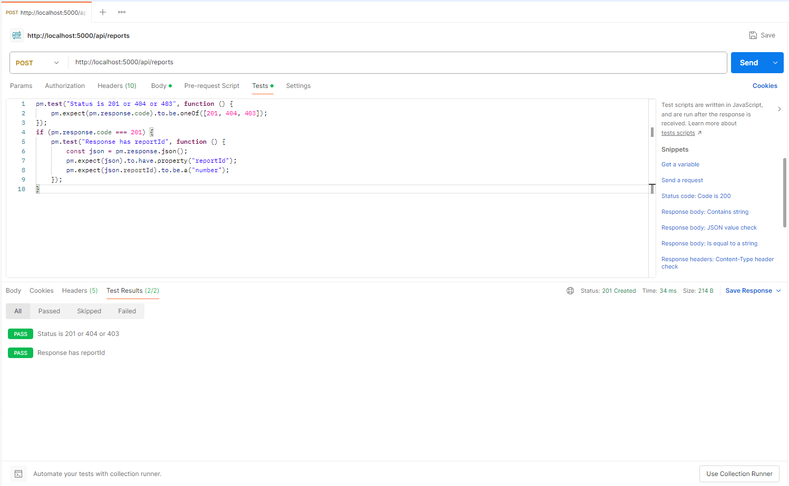

**Автотесты:**

```javascript
pm.test("Status is 201 or 404 or 403", function () {
    pm.expect(pm.response.code).to.be.oneOf([201, 404, 403]);
});
if (pm.response.code === 201) {
    pm.test("Response has reportId", function () {
        const json = pm.response.json();
        pm.expect(json).to.have.property("reportId");
        pm.expect(json.reportId).to.be.a("number");
    });
}
```

---

## 9. GET `/api/reports/id` - получение отчёта

GET-запрос по идентификатору отчёта завершился с кодом 200 OK. В ответе возвращены идентификатор отчёта, дата, формат файла и массив экспортов (путь к файлу, формат, дата экспорта).

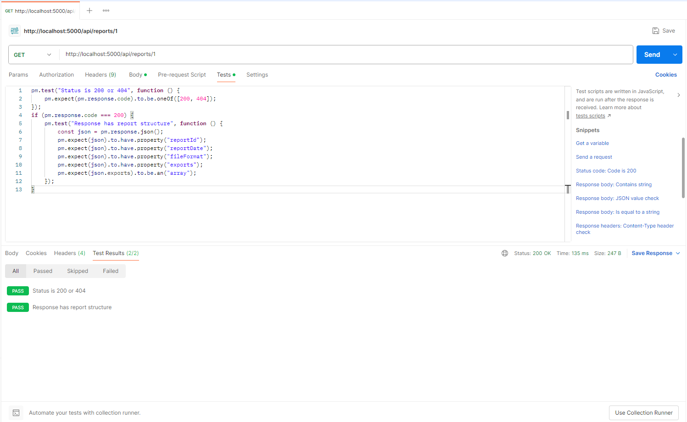

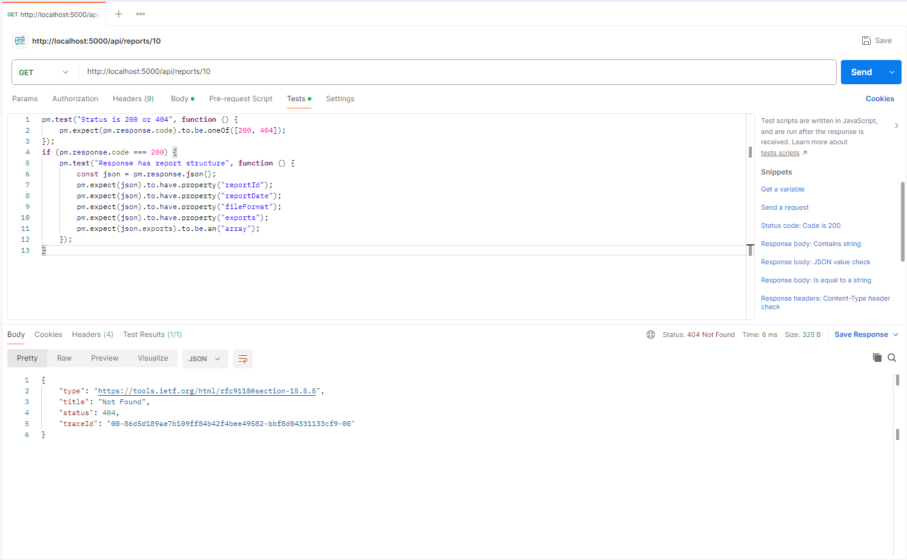

**Автотесты:**

```javascript
pm.test("Status is 200 or 404", function () {
    pm.expect(pm.response.code).to.be.oneOf([200, 404]);
});
if (pm.response.code === 200) {
    pm.test("Response has report structure", function () {
        const json = pm.response.json();
        pm.expect(json).to.have.property("reportId");
        pm.expect(json).to.have.property("reportDate");
        pm.expect(json).to.have.property("fileFormat");
        pm.expect(json).to.have.property("exports");
        pm.expect(json.exports).to.be.an("array");
    });
}
```

---

## 10. GET `/api/reports` - список отчётов пользователя

GET-запрос без параметров (с заголовком X-User-Id) завершился с кодом 200 OK. В ответе возвращён список отчётов пользователя: для каждого — идентификатор, дата и формат файла.

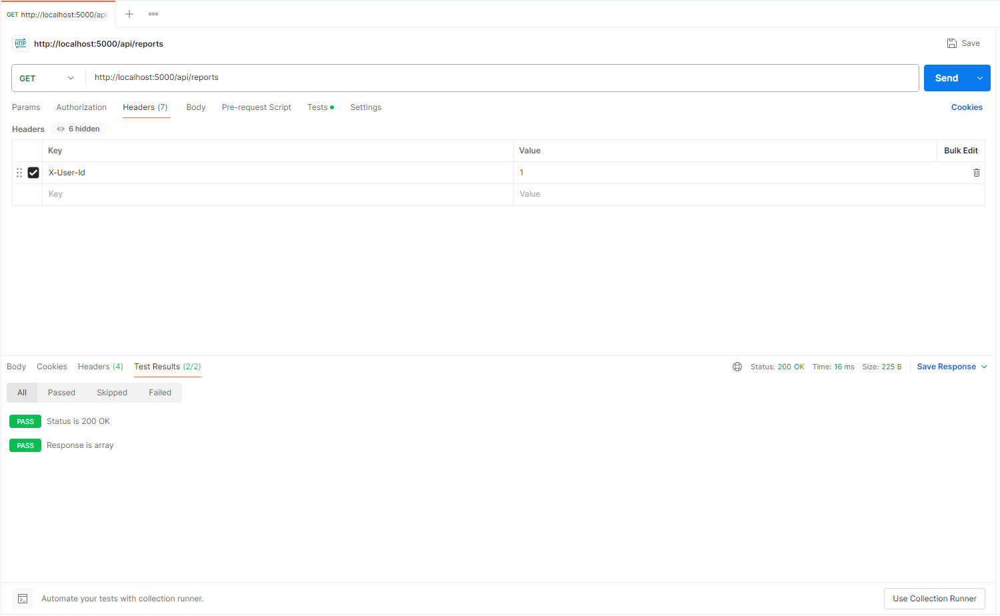

**Автотесты:**

```javascript
pm.test("Status is 200 OK", function () {
    pm.response.to.have.status(200);
});
pm.test("Response is array", function () {
    pm.expect(pm.response.json()).to.be.an("array");
});
```

---

## 11. GET `/api/bot-detection/dequeue` - получение задачи

GET-запрос без параметров завершился с кодом 200 OK. В ответе возвращены идентификатор задачи historyId, идентификатор пользователя, соцсеть и массив аккаунтов с идентификаторами и именами для обработки.

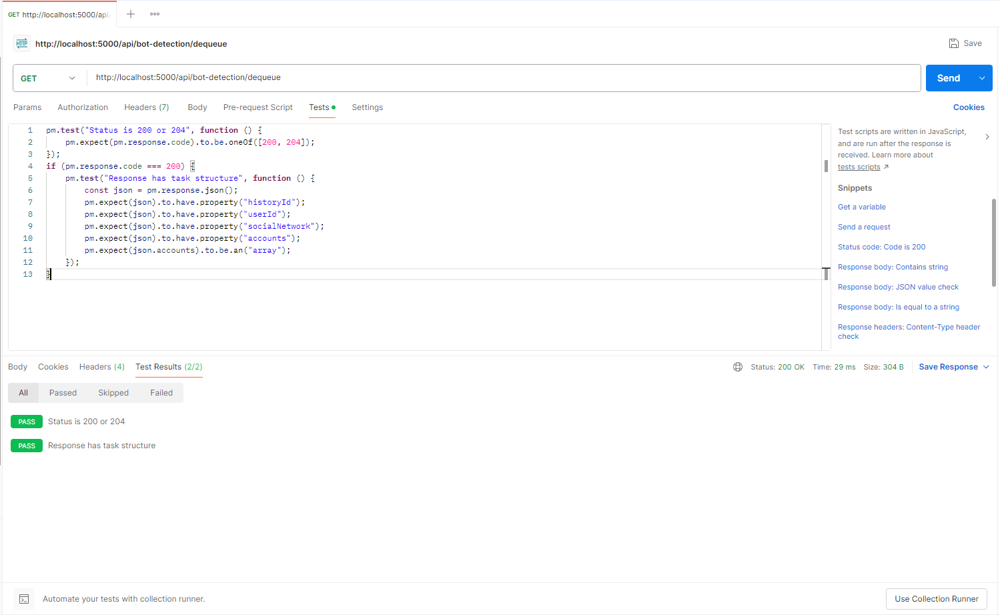

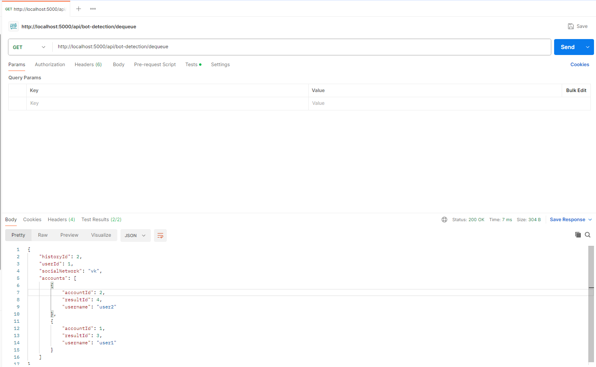

**Автотесты:**

```javascript
pm.test("Status is 200 or 204", function () {
    pm.expect(pm.response.code).to.be.oneOf([200, 204]);
});
if (pm.response.code === 200) {
    pm.test("Response has task structure", function () {
        const json = pm.response.json();
        pm.expect(json).to.have.property("historyId");
        pm.expect(json).to.have.property("userId");
        pm.expect(json).to.have.property("socialNetwork");
        pm.expect(json).to.have.property("accounts");
        pm.expect(json.accounts).to.be.an("array");
    });
}
```

---

## 12. POST `/api/bot-detection/results` - сохранение результата

POST-запрос с корректным телом (идентификатор анализа, идентификатор результата, идентификатор рейтинга и статус) завершился с кодом 200 OK. Результат анализа сохранён. При неверных данных возвращены 404 Not Found или 400 Bad Request с сообщением об ошибке.

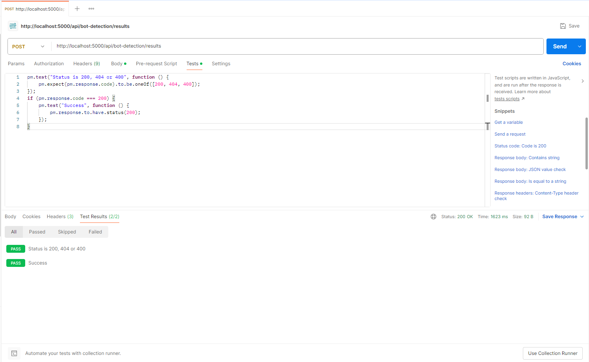

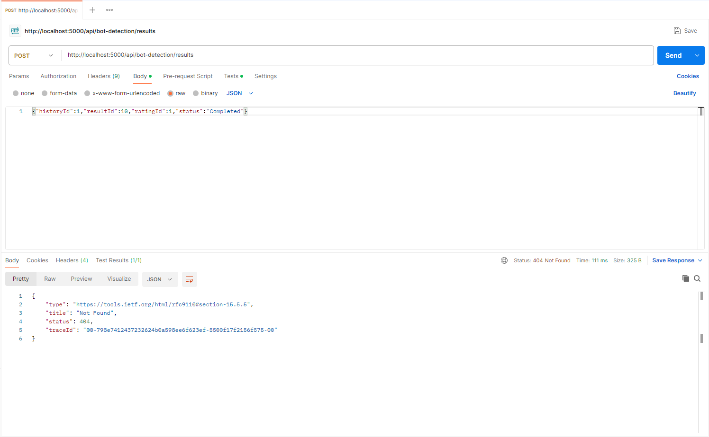

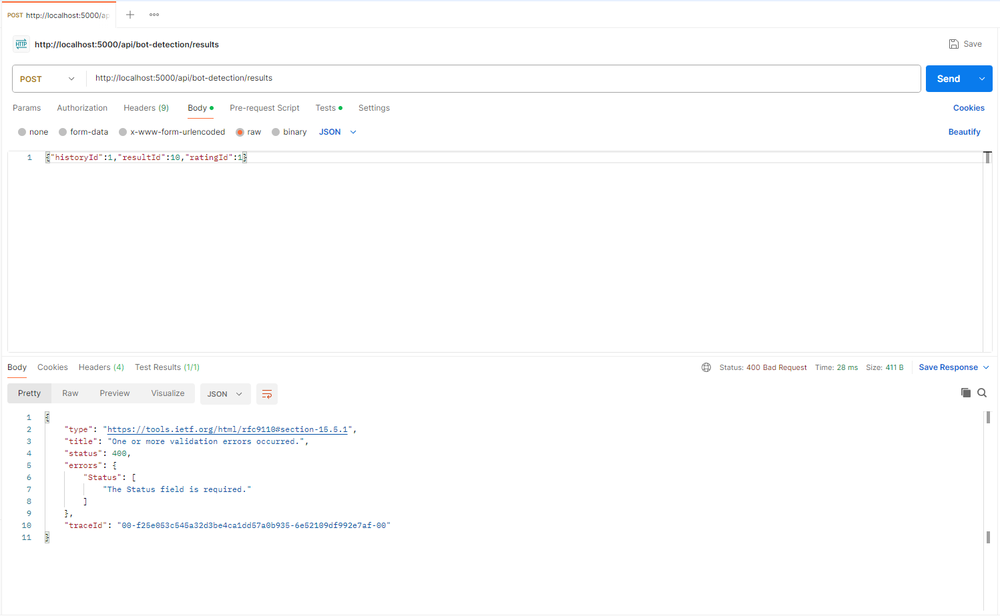

**Автотесты:**

```javascript
pm.test("Status is 200, 404 or 400", function () {
    pm.expect(pm.response.code).to.be.oneOf([200, 404, 400]);
});
if (pm.response.code === 200) {
    pm.test("Success", function () {
        pm.response.to.have.status(200);
    });
}
```
